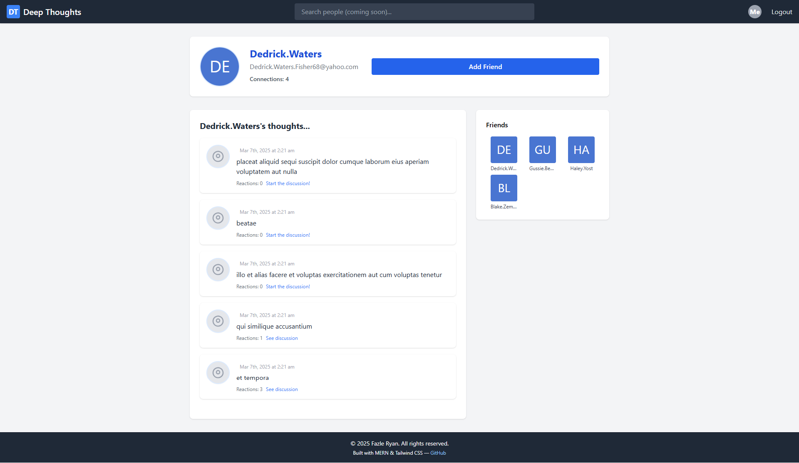

# deep-thoughts

## Screenshot:

## Description:
A social media application called Deep Thoughts is built with MERN stack. Users will be able to sign up and create an account, post their thoughts, and interact with other users, just like other social media apps we use day in and day out in real life.

## Tasks completed in brief:
- Integrate the Apollo Server GraphQL library to handle data requests.
- Build both query type definitions and resolvers for retrieving data from a MongoDB database.
- Use the GraphQL Playground interface to thoroughly test GraphQL queries.
- Use GraphQL mutations to handle updates to a database.
- Sign and verify JSON Web Tokens as part of the authentication process.
- Use the Apollo Client library to consume GraphQL APIs on the front end.
- Use Route and Switch components to set up client-side routing.
- Implement login functionality and user-based navigation in React.

## Link to the site:
https://deepthougts-fb5fa1bf4ca4.herokuapp.com/

For Demo purpose login with (email:ryan7998@gmail.com, password: user1234)
